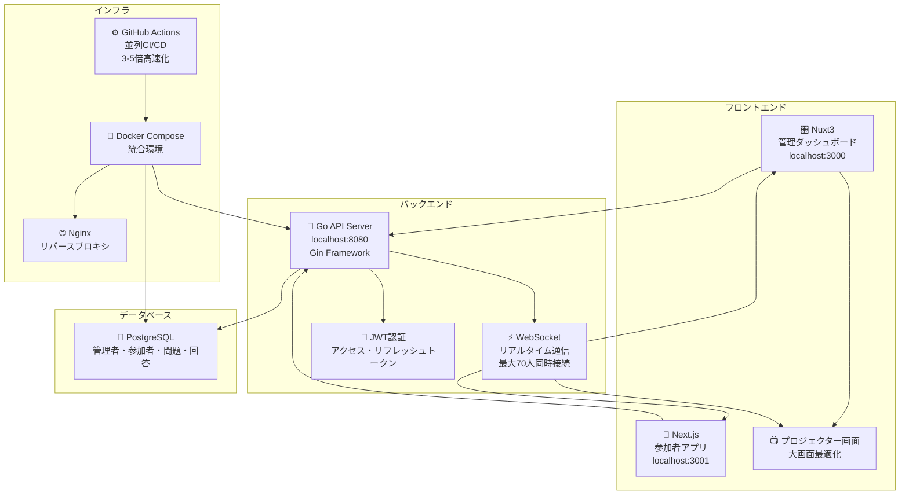

# リアルタイムクイズ大会システム

リアルタイムクイズ大会を開催するための統合システムです。Go言語バックエンドAPI、Nuxt3管理ダッシュボード、Next.js参加者アプリから構成され、**最大70人の同時接続**に対応したWebSocketリアルタイム通信を実現しています。

## 🏗️ システムアーキテクチャ



## ✨ 主要機能

### 🎯 リアルタイム機能
- **WebSocketリアルタイム通信**: 最大70人同時接続対応
- **ライブ問題切り替え**: 管理者操作で全参加者の画面が同期更新
- **リアルタイム回答集計**: 回答状況のライブ表示
- **ライブランキング**: 総合・問題別ランキングのリアルタイム更新
- **自動接続管理**: ハートビート機能による接続監視・自動クリーンアップ

### 👨‍💼 管理者機能
- **管理者認証**: JWT（アクセス・リフレッシュトークン）
- **問題管理**: CRUD操作、画像アップロード対応
- **セッション制御**: クイズ開始・終了・問題切り替え
- **リアルタイム統計**: 参加者数・回答状況・正答率の監視
- **プロジェクター表示**: 大画面表示用の専用画面

### 📱 参加者機能
- **簡単参加**: ニックネーム入力のみで参加可能
- **スマートフォン最適化**: 大きなボタン、タッチ操作対応
- **回答変更**: 投票終了まで回答変更可能
- **ユニバーサルデザイン**: 高コントラスト、読みやすいフォント
- **リアルタイム同期**: 問題表示・結果発表の同期

## システム構成

### 🔧 Go言語バックエンドAPI (ルート)
- **言語**: Go 1.24+
- **フレームワーク**: Gin  
- **データベース**: PostgreSQL
- **認証**: JWT
- **リアルタイム通信**: WebSocket
- **パスワードハッシュ**: bcrypt

### 🎛️ Nuxt3管理ダッシュボード (admin-dashboard/)
- **フレームワーク**: Nuxt3
- **スタイリング**: Tailwind CSS
- **機能**: 問題管理、セッション制御、リアルタイム統計表示

### 📱 Next.js参加者アプリ (participant-app/)
- **フレームワーク**: Next.js 14 (App Router)
- **言語**: TypeScript
- **スタイリング**: Tailwind CSS  
- **機能**: スマートフォン向けクイズ参加、ユニバーサルデザイン対応

## セットアップ

### 1. 全体の依存関係インストール

#### Go言語バックエンド
```bash
go mod download
```

#### Nuxt3管理ダッシュボード
```bash
cd admin-dashboard
npm install
```

#### Next.js参加者アプリ  
```bash
cd participant-app
npm install
```

## 🚀 CI/CD とテスト

### 高速化されたCI構成

このプロジェクトは**並列稼働**と**高度なキャッシュ戦略**により、CI実行時間を大幅に短縮しています：

#### 並列実行の最適化

1. **コード品質チェック** (並列実行)
   - `go-format`: コードフォーマット検証
   - `go-lint`: Linting (golangci-lint)
   - `go-vet`: Go静的解析

2. **テスト実行** (並列実行)
   - `go-unit-tests`: パッケージ別単体テスト (handlers, services, other)
   - `go-integration-tests`: 統合テスト
   - `go-performance-tests`: パフォーマンステスト (70人同時接続)

3. **カバレッジ統合**
   - `go-coverage-report`: 全カバレッジレポートのマージと閾値チェック

#### キャッシュ戦略

- **Goモジュールキャッシュ**: `~/.cache/go-build`, `~/go/pkg/mod`
- **Linterキャッシュ**: `~/.cache/golangci-lint`
- **パッケージ別キャッシュ**: テストグループごとに最適化されたキャッシュキー

#### 高速化メリット

- **実行時間**: 従来の順次実行に比べ約 **3-5倍高速**
- **並列度**: 単体テストで`-parallel 8`、統合テストで`-parallel 4`
- **リソース効率**: 各ジョブが独立してCPUを活用

### Makefileによる開発支援

```bash
# 並列実行でのテスト
make test-parallel          # パッケージ別並列テスト
make test-unit             # 単体テストのみ
make test-integration      # 統合テストのみ
make test-performance      # パフォーマンステストのみ

# 並列実行でのコード品質チェック
make check                 # format, lint, vet を並列実行

# CI環境向け最適化
make ci-test              # CI用テストスイート
make benchmark            # ベンチマーク実行

# 並列度の調整
PARALLELISM=16 make test   # 並列度を16に設定
```

### テスト実行例

```bash
# 通常の並列テスト
make test-parallel

# 高並列度での実行
PARALLELISM=16 make test-unit

# パフォーマンステスト（70人同時接続）
make test-performance
```

### 2. 環境設定

`.env.example`をコピーして`.env`ファイルを作成：

```bash
cp .env.example .env
```

`.env`ファイルを編集してデータベース設定等を行います：

```env
# データベース設定
DB_HOST=localhost
DB_PORT=5432
DB_USER=quiz_user
DB_PASSWORD=quiz_password
DB_NAME=quiz_db
DB_SSLMODE=disable

# JWT設定
JWT_SECRET=your-super-secret-jwt-key-here
JWT_EXPIRES_HOURS=24

# サーバー設定
PORT=8080
```

### 3. データベースセットアップ

PostgreSQLデータベースを作成し、`database_schema.sql`を実行：

```bash
# PostgreSQLにログイン
psql -U postgres

# データベースとユーザーを作成
CREATE DATABASE quiz_db;
CREATE USER quiz_user WITH PASSWORD 'quiz_password';
GRANT ALL PRIVILEGES ON DATABASE quiz_db TO quiz_user;

# スキーマを適用
\c quiz_db
\i database_schema.sql
```

### 4. 管理者ユーザーの作成

初回起動前に管理者ユーザーを手動で作成する必要があります：

```sql
-- パスワードハッシュを生成（例: password123）
INSERT INTO administrators (username, password_hash, email) 
VALUES ('admin', '$2a$10$N9qo8uLOickgx2ZMRZoMyeIjZAgcfl7p92ldGxad68LJZdL17lhWy', 'admin@example.com');
```

### 5. アプリケーション起動

#### Go言語バックエンド
```bash
go run main.go
```
サーバーは `http://localhost:8080` で起動します。

#### Nuxt3管理ダッシュボード  
```bash
cd admin-dashboard
npm run dev
```
管理ダッシュボードは `http://localhost:3000` で起動します。

#### Next.js参加者アプリ
```bash
cd participant-app
npm run dev  
```
参加者アプリは `http://localhost:3001` で起動します。

## 📚 ドキュメント

### 📖 技術仕様・設計書
- **[API設計書](api_design.md)**: 詳細なREST API仕様
- **[データベース設計](er_diagram.md)**: ER図とスキーマ設計
- **[アーキテクチャ図](#システムアーキテクチャ)**: システム全体構成

### 🚀 運用・デプロイ
- **[デプロイメントガイド](DEPLOYMENT.md)**: 本番環境セットアップ
- **[WebSocket技術ガイド](WEBSOCKET_GUIDE.md)**: リアルタイム通信の実装詳細
- **[プロジェクター機能ガイド](PROJECTOR_GUIDE.md)**: 大画面表示の使用方法

### 🔧 開発・保守
- **[開発ガイドライン](CLAUDE.md)**: コーディング規約・品質基準
- **[テストガイド](TEST_GUIDE.md)**: テスト実行・CI/CD手順
- **[トラブルシューティング](TROUBLESHOOTING.md)**: 問題解決方法

## API仕様

詳細なAPI仕様は**[API設計書](api_design.md)**を参照してください。

### 主要エンドポイント

#### 管理者認証
- `POST /api/admin/login` - ログイン
- `POST /api/admin/logout` - ログアウト
- `GET /api/admin/verify` - トークン検証

#### 問題管理
- `GET /api/admin/quizzes` - 問題一覧
- `POST /api/admin/quizzes` - 問題作成
- `PUT /api/admin/quizzes/{id}` - 問題更新
- `DELETE /api/admin/quizzes/{id}` - 問題削除

#### セッション管理
- `POST /api/admin/session/start` - セッション開始
- `POST /api/admin/session/next` - 次の問題
- `POST /api/admin/session/end` - セッション終了
- `GET /api/session/status` - セッション状態取得

#### 参加者・回答
- `POST /api/participants/register` - 参加者登録
- `POST /api/answers` - 回答送信
- `PUT /api/answers/{id}` - 回答変更

#### 集計・ランキング
- `GET /api/results/current` - 現在の集計結果
- `GET /api/ranking/overall` - 総合ランキング

#### WebSocket
- `WS /api/ws/results` - リアルタイム結果更新

## 使用例

### 1. 管理者ログイン

```bash
curl -X POST http://localhost:8080/api/admin/login \
  -H "Content-Type: application/json" \
  -d '{"username": "admin", "password": "password123"}'
```

### 2. 問題作成

```bash
curl -X POST http://localhost:8080/api/admin/quizzes \
  -H "Content-Type: application/json" \
  -H "Authorization: Bearer YOUR_TOKEN" \
  -d '{
    "question_text": "Go言語の開発元は？",
    "option_a": "Google",
    "option_b": "Microsoft", 
    "option_c": "Apple",
    "option_d": "Meta",
    "correct_answer": "A"
  }'
```

### 3. 参加者登録

```bash
curl -X POST http://localhost:8080/api/participants/register \
  -H "Content-Type: application/json" \
  -d '{"nickname": "参加者A"}'
```

### 4. 回答送信

```bash
curl -X POST http://localhost:8080/api/answers \
  -H "Content-Type: application/json" \
  -d '{
    "participant_id": 1,
    "quiz_id": 1,
    "selected_option": "A"
  }'
```

## ファイル構成

```
.
├── main.go                        # Go バックエンドメイン
├── go.mod                         # Go モジュール定義
├── .env.example                   # 環境変数テンプレート
├── database_schema.sql            # データベーススキーマ
├── api_design.md                  # API設計書
├── CLAUDE.md                      # 開発ルール
├── README.md                      # プロジェクト説明
├── internal/                      # Go バックエンド
│   ├── database/                  # データベース接続
│   ├── handlers/                  # HTTPハンドラ
│   ├── middleware/                # ミドルウェア
│   ├── models/                    # データモデル
│   └── services/                  # ビジネスロジック
├── uploads/                       # アップロードファイル
│   └── images/
├── admin-dashboard/               # Nuxt3管理ダッシュボード
│   ├── components/                # Vueコンポーネント
│   ├── pages/                     # ページ
│   ├── layouts/                   # レイアウト
│   ├── middleware/                # ミドルウェア
│   ├── assets/                    # アセット
│   ├── nuxt.config.ts             # Nuxt設定
│   ├── package.json               # 依存関係
│   └── README.md                  # 管理ダッシュボード説明
└── participant-app/               # Next.js参加者アプリ
    ├── src/
    │   ├── app/                   # App Router
    │   ├── components/            # Reactコンポーネント
    │   ├── lib/                   # ユーティリティ
    │   └── types/                 # TypeScript型定義
    ├── next.config.js             # Next.js設定
    ├── package.json               # 依存関係
    └── README.md                  # 参加者アプリ説明
```

## コード品質・テスト

### リント・フォーマット

#### Go言語バックエンド
```bash
# gofumptによるコードフォーマット
make fmt

# golangci-lintによる静的解析
make lint

# vetチェック
make vet

# 全チェックを一括実行
make check
```

#### Nuxt3管理ダッシュボード
```bash
cd admin-dashboard
npm run lint    # ESLintチェック
npm run test    # Vitestテスト実行
```

#### Next.js参加者アプリ
```bash
cd participant-app
npm run lint    # Next.jsリント
npm run test    # Jestテスト実行
```

### テスト実行

#### 全プロジェクトのテスト
```bash
# Go言語テスト（データベース接続が必要）
go test ./...

# Nuxt3テスト
cd admin-dashboard && npm test

# Next.jsテスト  
cd participant-app && npm test
```

#### テストカバレッジ
```bash
# Go言語テストカバレッジ
go test -coverprofile=coverage.out ./...
go tool cover -html=coverage.out
```

### ビルド確認

#### 全プロジェクトビルド
```bash
# Go言語バックエンド
go build .

# Nuxt3管理ダッシュボード
cd admin-dashboard && npm run build

# Next.js参加者アプリ
cd participant-app && npm run build
```

## 品質状況

### ✅ プロジェクト品質サマリー（2025年12月更新）

| プロジェクト | Lint | テスト | ビルド | カバレッジ | パフォーマンス |
|------------|------|--------|--------|----------|-------------|
| **Go Backend** | ✅ 完全対応 | ✅ 単体・統合・パフォーマンス | ✅ 成功 | 40.5% | 70人同時接続 |
| **Nuxt3 Dashboard** | ✅ ESLint完全 | ✅ 14/14成功 | ✅ 成功 | Chart.js統合 | プロジェクター対応 |
| **Next.js App** | ✅ 100%成功 | ✅ Jest成功 | ✅ 成功 | TypeScript厳密 | スマホ最適化 |
| **CI/CD Pipeline** | ✅ 並列実行 | ✅ 3-5倍高速化 | ✅ Docker対応 | 統合レポート | GitHub Actions |

### 🔧 実装済み品質改善

#### Goバックエンド
- 型安全なデータ処理（チェック付き型アサーション）
- セキュリティ強化（ファイルパス検証、セキュリティコメント）
- 未使用関数・パラメータの適切な削除・無効化
- エクスポート関数のドキュメント完備
- 定数の積極活用によるハードコーディング撲滅

#### フロントエンド共通
- ESLint 100%成功
- 外部ライブラリの適切なモック
- TypeScript厳密型チェック
- React Hook適切な使用

### 🚀 開発者向けクイックスタート

#### 新規開発者向け初期セットアップ
```bash
# 1. 依存関係インストール
go mod download
cd admin-dashboard && npm install && cd ..
cd participant-app && npm install && cd ..

# 2. 品質チェック実行
make check                    # Go: format, lint, test
cd admin-dashboard && npm test && cd ..  # Nuxt3テスト
cd participant-app && npm run lint && cd ..  # Next.jsリント

# 3. 全プロジェクトビルド確認
go build .
cd admin-dashboard && npm run build && cd ..
cd participant-app && npm run build && cd ..
```

## セキュリティ

- JWT認証によるAPI保護
- bcryptによるパスワードハッシュ化
- CORS設定対応
- レート制限実装
- ファイルアップロード制限
- ファイルパス検証によるディレクトリトラバーサル対策
- 型安全なデータ処理

## アーキテクチャ

### DDD (Domain Driven Design)
- ドメインロジックをビジネスルールの中心に配置
- 技術的関心事からの明確な分離
- ubiquitous language（ユビキタス言語）による開発者・ドメインエキスパート間の共通理解

### t-wada思想
- テスト駆動開発（TDD）を基本
- テストを仕様書として機能させる
- 設計品質向上のためのテスト重視

### BFF (Backend for Frontend)
- フロントエンド専用のAPIレイヤー
- クライアント特有の要求に最適化
- 複数のバックエンドサービス統合によるフロントエンド複雑性軽減

## 開発・デプロイ

### 開発モード

```bash
# 開発モードで起動（詳細ログ）
GIN_MODE=debug go run main.go
```

### プロダクションビルド

```bash
# バイナリビルド
go build -o quiz-server main.go

# 実行
./quiz-server
```

### Docker対応

Dockerfileを追加する場合：

```dockerfile
FROM golang:1.24-alpine AS builder
WORKDIR /app
COPY go.mod go.sum ./
RUN go mod download
COPY . .
RUN go build -o quiz-server main.go

FROM alpine:latest
RUN apk --no-cache add ca-certificates
WORKDIR /root/
COPY --from=builder /app/quiz-server .
COPY --from=builder /app/.env .
CMD ["./quiz-server"]
```

## ライセンス

MIT License