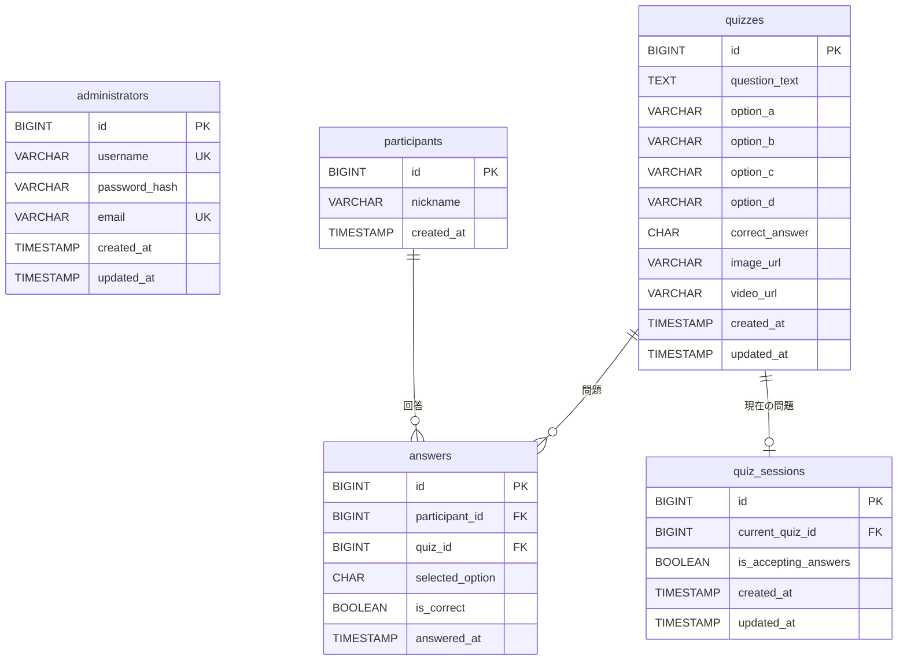

# クイズ大会システム ER図

## Mermaid ER図

## 関係性の説明

### テーブル間の関係

1. **participants → answers** (1:N)
   - 一人の参加者は複数の問題に回答できる
   - 外部キー: `answers.participant_id` → `participants.id`

2. **quizzes → answers** (1:N)
   - 一つの問題に対して複数の参加者が回答できる
   - 外部キー: `answers.quiz_id` → `quizzes.id`

3. **quizzes → quiz_sessions** (1:0..1)
   - 一つの問題は現在のセッション問題として設定される可能性がある
   - 外部キー: `quiz_sessions.current_quiz_id` → `quizzes.id`

### 制約条件

- `answers`テーブルには`(participant_id, quiz_id)`の複合UNIQUE制約があり、一人の参加者が同じ問題に複数回答することを防ぐ
- `correct_answer`と`selected_option`は'A', 'B', 'C', 'D'のいずれかの値のみ許可
- `administrators`の`username`と`email`はUNIQUE制約

### データの特徴

- **administrators**: 認証情報を持つ管理者（複数人）
- **participants**: 匿名参加者（ニックネームのみ）
- **quizzes**: 4択問題（画像・動画URL対応）
- **answers**: 回答履歴（正解判定含む）
- **quiz_sessions**: セッション状態管理（現在の問題、回答受付状況）
